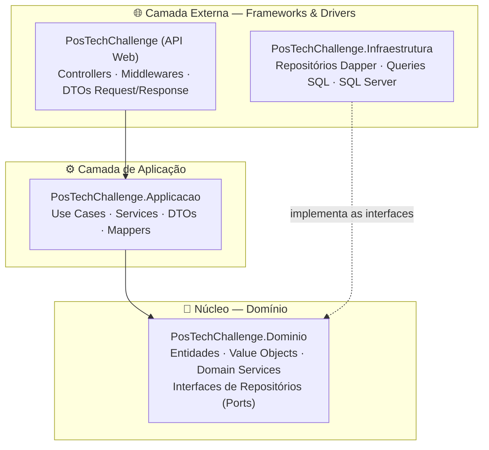
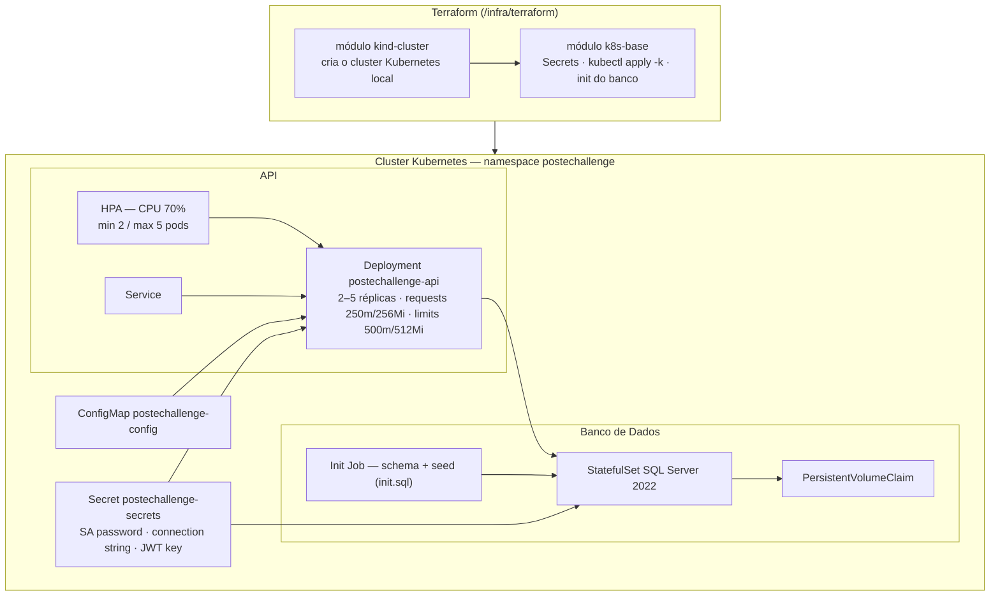
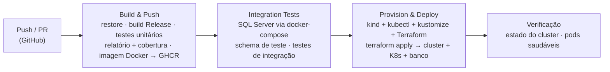

# PosTechChallenge — Sistema de Gestão de Oficina Mecânica

**Tech Challenge — FIAP PosTech SOAT | Fase 2**

Back-end para gestão de Ordens de Serviço (OS), clientes, veículos e peças de uma oficina mecânica de médio porte. Nesta fase, a aplicação da Fase 1 evolui para garantir **qualidade, resiliência e escalabilidade**, incorporando práticas modernas de infraestrutura e automação.

---

## 🎯 Objetivos da Fase 2

Após a implantação do sistema inicial, o aumento da demanda e a expansão para novas unidades exigiram evoluir a aplicação para:

- **Reduzir riscos operacionais** por meio de infraestrutura escalável (Kubernetes + HPA);
- **Automatizar o provisionamento e o deploy** do ambiente (Terraform + CI/CD);
- **Melhorar a qualidade e a organização do código** (refatoração com Clean Code e Clean Architecture, cobertura de testes unitários e de integração);
- **Suportar grandes volumes de OS em horários de pico**, com escalabilidade dinâmica baseada em consumo de CPU.

### O que foi entregue nesta fase

| Frente | Entrega |
|---|---|
| Aplicação | Refatoração com Clean Code e princípios de Clean Architecture; novas APIs de abertura de OS, consulta pública de status, aprovação de orçamento via notificação externa e listagem ordenada por status |
| Conteinerização | `Dockerfile` multi-stage revisado + `docker-compose` para desenvolvimento local |
| Orquestração | Manifestos Kubernetes em `/k8s` (Deployments, Services, ConfigMaps, Secrets, HPA) com Kustomize (base + overlays `local` e `ci`) |
| IaC | Scripts Terraform em `/infra/terraform` (cluster kind + recursos K8s + banco de dados) |
| CI/CD | Pipeline GitHub Actions: build → testes unitários → imagem Docker (GHCR) → testes de integração → provisionamento Terraform → deploy no cluster |

---

## 🏗️ Arquitetura

### Arquitetura da aplicação

A solução segue os princípios da **Clean Architecture**: a **regra de dependência** aponta sempre para o centro — o domínio não conhece nenhuma camada externa, e frameworks, banco de dados e web são detalhes nas bordas.



Pontos-chave:

- **Domínio** (`PosTechChallenge.Dominio`): entidades, Value Objects (CPF, CNPJ, Senha, Placa), Domain Services (máquina de estados da OS) e as **interfaces de repositórios (ports)** — sem nenhuma dependência externa.
- **Aplicação** (`PosTechChallenge.Applicacao`): Use Cases orquestram as regras de negócio consumindo apenas abstrações do domínio.
- **Infraestrutura** (`PosTechChallenge.Infraestrutura`): **adapters** que implementam os ports do domínio com Dapper + SQL Server; queries centralizadas em classes estáticas.
- **API** (`PosTechChallenge`): adapter de entrada (REST), com autenticação JWT, rate limiting de login e monitoramento de tempo de execução.

### Máquina de estados da OS

```
Recebida → Em Diagnóstico → Aguardando Aprovação → Em Execução → Finalizada → Entregue
```

Transições estritamente sequenciais, validadas no domínio (`OrdemServicoDomainService`).

### Infraestrutura provisionada



Recursos criados pelo Terraform:

| Recurso | Descrição |
|---|---|
| Cluster kind | Cluster Kubernetes local (módulo `kind-cluster`), configurado via `infra/kind-config.yaml` |
| Secrets K8s | `mssql_sa_password`, `app_db_password`, `jwt_secret_key` injetados via variáveis Terraform (`TF_VAR_*`) |
| Manifestos K8s | Aplicados via Kustomize (`k8s/overlays/local` ou `k8s/overlays/ci`) |
| Banco de dados | SQL Server 2022 como StatefulSet + PVC, com Job de inicialização executando `infra/sql/init.sql` (schema + seed) |
| imagePullSecret GHCR | Criado apenas no CI, para puxar a imagem publicada no GitHub Container Registry |

### Fluxo de deploy (CI/CD)



O pipeline (`.github/workflows/ci-cd.yml`) executa, em sequência: **build da aplicação**, **testes automatizados** (unitários com relatório e cobertura publicados como artefatos), **build e push da imagem Docker** para o GHCR, **testes de integração** contra SQL Server real, e **deploy completo** — Terraform provisiona o cluster, aplica os manifestos YAML via Kustomize (overlay `ci`, com a imagem recém-construída) e inicializa o banco de dados.

---

## 🧩 Entidades principais

| Entidade | Descrição |
|---|---|
| Cliente | Pessoa física (CPF) ou jurídica (CNPJ) |
| Funcionário | Colaborador da oficina com cargo e valor/hora |
| Veículo | Veículo do cliente identificado por placa |
| Ordem de Serviço | Ciclo completo de atendimento com máquina de estados |
| Peças | Itens de estoque com controle de quantidade |
| Item OS | Mão de obra ou peça vinculada à OS |
| Orçamento | Cálculo e envio de orçamento da OS, com resposta do cliente |

---

## 🚀 Execução local (Docker Compose)

### Pré-requisitos

- [Docker](https://www.docker.com/get-started) em execução
- [Docker Compose](https://docs.docker.com/compose/install/) v2+

### Passos

```bash
git clone <URL_DO_REPOSITORIO>
cd PosTechChallenge

# Crie o .env a partir do exemplo e ajuste os valores
cp .env.example .env

# Suba o ambiente completo (SQL Server + API)
docker compose up -d --build
```

O compose irá: (1) iniciar o **SQL Server 2022**; (2) aguardar o banco ficar saudável e executar `infra/sql/init.sql` (schema + seed); (3) buildar e iniciar a **API** na porta `8080`.

> ⚠️ Na primeira execução, aguarde 60–90 segundos até o SQL Server inicializar completamente.

Acesse o Swagger em:

```
http://localhost:8080/swagger
```

### Testes

```bash
# Unitários
dotnet test PosTechChallenge.Testes/PosTechChallenge.Testes.csproj

# Integração (requer o SQL Server do docker-compose.integration.yml)
docker compose -f docker-compose.integration.yml up -d
dotnet test PosTechChallenge.Testes.Integracao/PosTechChallenge.Testes.Integracao.csproj
```

---

## ☸️ Deploy em Kubernetes

Os manifestos estão em `/k8s`, organizados com **Kustomize**:

```
k8s/
├── base/                 # Namespace, ConfigMap, API (Deployment/Service/HPA), SQL Server (StatefulSet/PVC/Service/Init Job)
├── overlays/
│   ├── local/            # Overlay para cluster local (kind)
│   └── ci/               # Overlay usado pelo pipeline (imagem do GHCR)
└── secret.yaml.example   # Modelo de Secret — nunca versione o Secret real
```

### Opção A — Script automatizado (Windows)

```bat
local-k8s-up.bat
```

O script cria o cluster kind, builda a imagem local, aplica os manifestos e inicializa o banco.

### Opção B — Passo a passo manual

```bash
# 1. Crie o cluster kind
kind create cluster --name postechallenge --config infra/kind-config.yaml

# 2. Builde e carregue a imagem no cluster
docker build -t postechallenge-api:local .
kind load docker-image postechallenge-api:local --name postechallenge

# 3. Crie o Secret (a partir do exemplo)
cp k8s/secret.yaml.example k8s/secret.yaml   # edite os valores
kubectl apply -f k8s/secret.yaml

# 4. Aplique os manifestos via Kustomize
kubectl apply -k k8s/overlays/local

# 5. Acompanhe
kubectl get pods -n postechallenge -w
```

### Escalabilidade automática (HPA)

O HPA escala o Deployment da API entre **2 e 5 réplicas** quando o consumo de CPU ultrapassa **70%**, com janelas de estabilização de 30s (scale-up) e 120s (scale-down):

```bash
kubectl get hpa -n postechallenge -w
```

Para simular carga e observar o scale-up, dispare múltiplas criações/consultas de OS (ex.: com [hey](https://github.com/rakyll/hey) ou k6) contra o Service da API.

---

## 🌍 Provisionamento com Terraform (IaC)

Os scripts estão em `/infra/terraform`, organizados em dois módulos executados em ordem:

1. **`kind-cluster`** — cria o cluster Kubernetes local (kind);
2. **`k8s-base`** — cria os Secrets, aplica os manifestos (`kubectl apply -k` no overlay escolhido) e executa o Job de inicialização do banco (`infra/sql/init.sql`).

### Como aplicar

```bash
cd infra/terraform

# Configure as variáveis sensíveis (a partir do exemplo)
cp terraform.tfvars.example terraform.tfvars   # edite os valores

terraform init
terraform validate
terraform plan
terraform apply
```

### Variáveis

| Variável | Descrição |
|---|---|
| `cluster_name` | Nome do cluster kind |
| `kustomize_overlay` | Overlay a aplicar (`local` ou `ci`) |
| `mssql_sa_password` | Senha SA do SQL Server (sensível) |
| `app_db_password` | Senha do usuário da aplicação no banco (sensível) |
| `jwt_secret_key` | Chave de assinatura JWT — mínimo 32 bytes (sensível) |
| `ghcr_username` / `ghcr_token` | Credenciais GHCR (usadas apenas no CI, via `TF_VAR_*`) |

> 🔐 Nunca versione `terraform.tfvars` com valores reais. No pipeline, as variáveis sensíveis são injetadas via GitHub Secrets (`TF_VAR_*`).

Para destruir o ambiente:

```bash
terraform destroy
```

---

## 🔐 Autenticação

A API utiliza **JWT Bearer Token** com política global de autorização (todos os endpoints exigem autenticação, exceto os explicitamente públicos).

1. **Cadastre um funcionário** com senha inicial — `POST /api/v1/funcionarios` *(público neste MVP para facilitar testes; em produção exigiria role administrativa)*;
2. **Faça login** — `POST /api/v1/autenticacao/login` — e receba o access token (validade de 15 min) + refresh token;
3. **Envie o token** no header `Authorization: Bearer <token>`.

Senhas são armazenadas com **BCrypt Enhanced (SHA-384)** e o login é protegido por **rate limiting**.

---

## 📋 APIs principais

| Grupo | Endpoint base | Autenticação |
|---|---|---|
| Autenticação | `/api/v1/autenticacao` | Pública |
| Clientes | `/api/v1/clientes` | JWT |
| Funcionários | `/api/v1/funcionarios` | JWT |
| Veículos | `/api/v1/veiculos` | JWT |
| Peças | `/api/v1/pecas` | JWT |
| Ordens de Serviço | `/api/v1/ordens-servico` | JWT |
| Itens de OS | `/api/v1/itens-os` | JWT |
| Orçamentos | `/api/v1/orcamentos` | JWT (resposta do cliente é pública) |
| Monitoramento | `/api/v1/monitoramento` | JWT |

### Destaques da Fase 2

- **Abertura de OS** — `POST /api/v1/ordens-servico`: cria a OS com status inicial `Recebida`, retornando sua identificação única;
- **Consulta pública de status** — `GET /api/v1/ordens-servico/{id}/status`: permite ao cliente acompanhar sua OS **sem autenticação**;
- **Aprovação de orçamento (webhook)** — `POST /api/v1/orcamentos/os/{idOS}/responder`: endpoint **público** para receber notificações externas de aprovação ou recusa do orçamento pelo cliente;
- **Listagem ordenada** — `GET /api/v1/ordens-servico/ordenado-por-status`: ordena por prioridade de status (*Em Execução > Aguardando Aprovação > Em Diagnóstico > Recebida*), com as mais antigas primeiro, **excluindo logicamente** as OS Finalizadas e Entregues;
- **Notificação por e-mail** — o envio de orçamento grava a mensagem em uma **outbox de e-mail** (`EmailOutbox`), desacoplando a comunicação com o cliente do fluxo transacional.

### 🔗 Collection completa das APIs (Swagger / OpenAPI)

A documentação completa das APIs está disponível via **Swagger / OpenAPI**:

- **Swagger UI interativo** (com a aplicação em execução): [`http://localhost:8080/swagger`](http://localhost:8080/swagger)
- **Especificação OpenAPI (arquivo versionado):** [`Doc/openapi.json`](Doc/openapi.json)

O arquivo [`Doc/openapi.json`](Doc/openapi.json) contém a especificação OpenAPI 3.0 completa e pode ser importado em qualquer visualizador (Swagger UI, [editor.swagger.io](https://editor.swagger.io), Postman, Insomnia) sem necessidade de subir a aplicação.

---

## 🎬 Vídeo demonstrativo

<!-- TODO: gravar e publicar o vídeo (YouTube ou Vimeo, público ou não listado, até 15 min) -->
📺 **Link:** `[INSERIR LINK DO VÍDEO — YouTube/Vimeo]`

O vídeo demonstra:

1. Deploy da aplicação (Terraform + Kubernetes);
2. Execução do pipeline de CI/CD;
3. Consumo das APIs (abertura de OS, consulta de status, aprovação de orçamento, listagem ordenada);
4. Escalabilidade automática via HPA sob carga simulada.

---

## 🐳 Variáveis de ambiente

| Variável | Descrição | Valor padrão no Docker |
|---|---|---|
| `ConnectionStrings__DefaultConnection` | String de conexão com o banco | Configurado no compose |
| `Jwt__SecretKey` | Chave secreta JWT (mín. 32 bytes) | Configurado no compose |
| `Jwt__Issuer` | Emissor do token | `PosTechChallenge` |
| `Jwt__Audience` | Audiência do token | `PosTechChallenge-API` |
| `Jwt__AccessTokenExpirationMinutes` | Validade do access token (min) | `15` |

---

## 📊 Monitoramento

`GET /api/v1/monitoramento/tempo-execucao-medio` retorna métricas de tempo médio de execução por rota, coletadas em tempo real via middleware.

---

## 📁 Estrutura do repositório

```
├── .github/workflows/ci-cd.yml     # Pipeline CI/CD (build, testes, imagem, deploy)
├── Doc/                            # Documentação (Event Storming, diagramas DDD, relatórios OWASP/SonarQube)
├── PosTechChallenge/               # API Web — adapter de entrada (Controllers, Middlewares, DTOs)
├── PosTechChallenge.Applicacao/    # Camada de aplicação (Use Cases, Services, Mappers)
├── PosTechChallenge.Dominio/       # Núcleo do domínio (Entidades, VOs, Domain Services, Ports)
├── PosTechChallenge.Infraestrutura/# Adapters de saída (Repositórios Dapper, Queries SQL)
├── PosTechChallenge.Testes/        # Testes unitários (xUnit + Moq)
├── PosTechChallenge.Testes.Integracao/ # Testes de integração (SQL Server real)
├── infra/
│   ├── kind-config.yaml            # Configuração do cluster kind
│   ├── sql/init.sql                # Schema + seed do banco
│   └── terraform/                  # IaC — módulos kind-cluster e k8s-base
├── k8s/                            # Manifestos Kubernetes (Kustomize: base + overlays local/ci)
├── docker-compose.yml              # Ambiente completo local
├── docker-compose.integration.yml  # SQL Server para testes de integração
├── Dockerfile                      # Build da API
└── local-k8s-up.bat                # Provisionamento local automatizado (Windows)
```

---

## 👥 Grupo

Projeto desenvolvido para o Tech Challenge — Fase 2 do curso **FIAP PosTech SOAT**.
