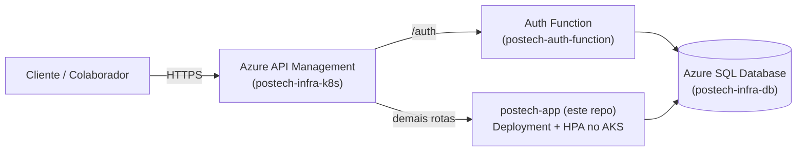
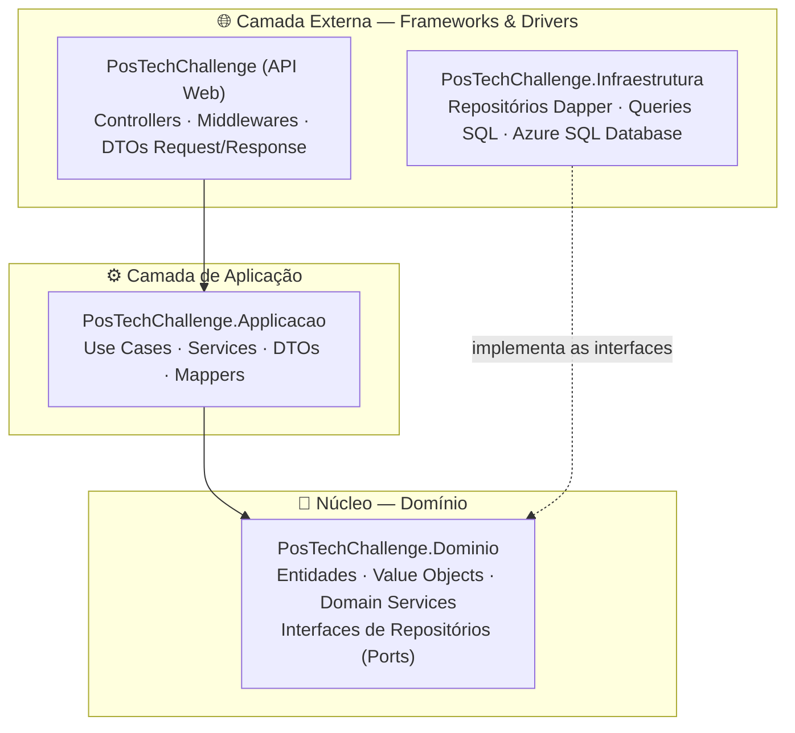
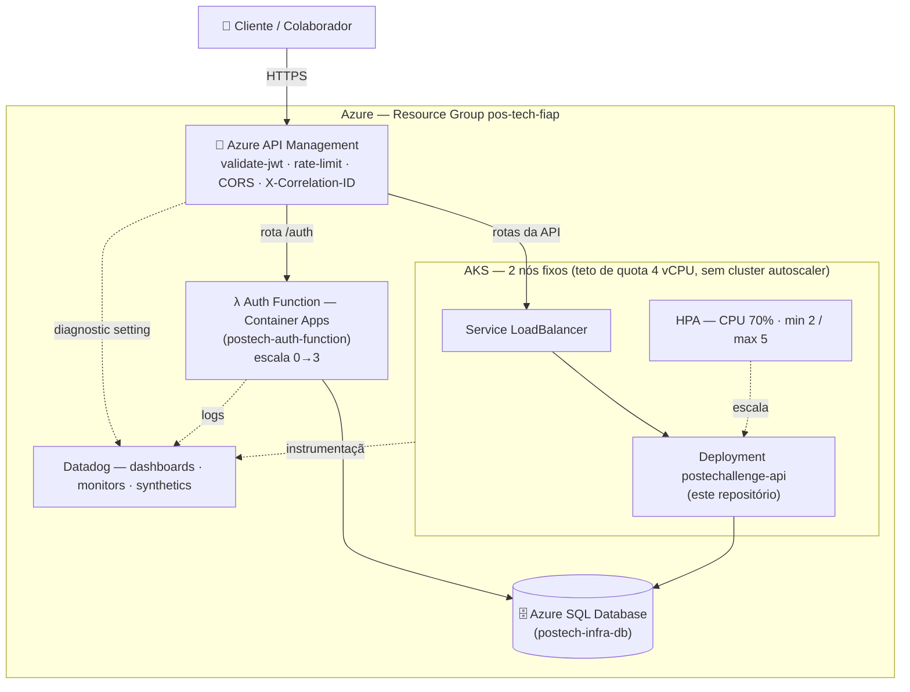
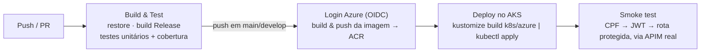

# PosTechChallenge — Sistema de Gestão de Oficina Mecânica

**Tech Challenge — FIAP PosTech SOAT | Fase 3**

Back-end para gestão de Ordens de Serviço (OS), clientes, veículos e peças de uma oficina mecânica de médio porte. Na Fase 3, o sistema deixa de rodar só em um cluster local: vai para a nuvem (Azure), ganha um gateway de API, uma função serverless de autenticação por CPF e observabilidade de ponta a ponta — mantendo a Clean Architecture e a escalabilidade via HPA já entregues na Fase 2.

Este repositório contém a **API principal** (o núcleo de negócio: clientes, veículos, peças, ordens de serviço, orçamentos) e é um de **quatro repositórios** que compõem a entrega. Veja [Repositórios da solução](#-repositórios-da-solução).

---

## 🎯 Objetivos da Fase 3

O enunciado exige evoluir a solução da Fase 2 para uma arquitetura de nuvem com gateway de API, função serverless para autenticação e observabilidade — decompondo a entrega em repositórios especializados, cada um com seu próprio ciclo de CI/CD.

### O que foi entregue nesta fase

| Frente | Entrega |
|---|---|
| Gateway de API | Azure API Management na frente de tudo: valida o JWT, aplica rate limiting por IP, propaga `X-Correlation-ID` e roteia para a API (AKS) ou para a Function de autenticação (Container Apps) — provisionado em [`postech-infra-k8s`](https://github.com/Gustavollier/postech-infra-k8s) |
| Autenticação por CPF | Function serverless dedicada, sem senha, que autentica o **cliente** e emite o mesmo tipo de JWT que a API aceita — [`postech-auth-function`](https://github.com/Gustavollier/postech-auth-function) |
| Banco gerenciado | Azure SQL Database, com o schema e os segredos administrados por Terraform próprio — [`postech-infra-db`](https://github.com/Gustavollier/postech-infra-db) |
| Autorização granular | Dois emissores de token (funcionário e cliente) distinguidos por `role`; rotas de operação exigem cargo de equipe (`Perfis.Equipe`); rotas de consulta do cliente passam por checagem de posse (`ClienteAcessandoOutro`) para que um cliente nunca leia dado de outro |
| Observabilidade | Datadog: Cluster Agent + admission controller instrumentando a API automaticamente, dashboards, monitors e synthetics — provisionado em `postech-infra-k8s` |
| CI/CD nesta API | GitHub Actions com login no Azure via OIDC (sem segredo de nuvem no repositório): build, testes unitários, imagem para o ACR e deploy no AKS, fechado por um smoke test que fala com o ambiente publicado de ponta a ponta (CPF → JWT → rota protegida) |

O que a Fase 2 já entregava — Clean Architecture, máquina de estados da OS, HPA, Kubernetes local via kind — continua valendo e está descrito abaixo; esta seção cobre apenas o que mudou.

---

## 🧩 Repositórios da solução

O edital da Fase 3 pede quatro repositórios com responsabilidades e pipelines separados. Este é o repositório da **aplicação**; os outros três são consumidos como serviços externos ou como infraestrutura provisionada à parte.

| # | Repositório | Responsabilidade |
|---|---|---|
| 1 | **[postech-auth-function](https://github.com/Gustavollier/postech-auth-function)** | Function serverless (.NET 8 isolated, Azure Functions v4) que autentica o cliente por CPF e emite o JWT que esta API valida |
| 2 | **[postech-infra-db](https://github.com/Gustavollier/postech-infra-db)** | Terraform do Azure SQL Database e do Azure Key Vault — fonte única da connection string e da chave JWT, consumidas pelos demais repositórios |
| 3 | **postech-app** *(este repositório)* | API principal — clientes, veículos, peças, ordens de serviço, orçamentos; Deployment e HPA que rodam no AKS |
| 4 | **[postech-infra-k8s](https://github.com/Gustavollier/postech-infra-k8s)** | Terraform do AKS, do Azure API Management, da hospedagem da Auth Function (Container Apps) e da observabilidade (Datadog) |



O contrato entre os repositórios não é um arquivo formal, mas dois mecanismos concretos: o **Azure Key Vault** criado por `postech-infra-db` é a fonte única da connection string e do segredo JWT, lida por Terraform tanto de `postech-infra-k8s` quanto da configuração da Function — nenhum dos dois gera ou versiona segredo por conta própria; e o **Azure Container Registry**, criado em `postech-infra-k8s`, é o ponto de encontro das imagens publicadas por este repositório (`postechallenge-api`) e por `postech-auth-function`.

---

## 🏗️ Arquitetura da aplicação

A solução segue os princípios da **Clean Architecture**: a **regra de dependência** aponta sempre para o centro — o domínio não conhece nenhuma camada externa, e frameworks, banco de dados e web são detalhes nas bordas.



Pontos-chave:

- **Domínio** (`PosTechChallenge.Dominio`): entidades, Value Objects (CPF, CNPJ, Senha, Placa), Domain Services (máquina de estados da OS) e as **interfaces de repositórios (ports)** — sem nenhuma dependência externa.
- **Aplicação** (`PosTechChallenge.Applicacao`): Use Cases orquestram as regras de negócio consumindo apenas abstrações do domínio.
- **Infraestrutura** (`PosTechChallenge.Infraestrutura`): **adapters** que implementam os ports do domínio com Dapper + SQL Server (Azure SQL Database em produção); queries centralizadas em classes estáticas.
- **API** (`PosTechChallenge`): adapter de entrada (REST), com autenticação JWT (dois emissores — veja [Autenticação](#-autenticação)), autorização por papel e por posse, e monitoramento de tempo de execução.
- Roda em **.NET 10**.

### Máquina de estados da OS

```
Recebida → Em Diagnóstico → Aguardando Aprovação → Em Execução → Finalizada → Entregue
```

Transições estritamente sequenciais, validadas no domínio (`OrdemServicoDomainService`).

---

## ☁️ Arquitetura de nuvem (produção)

A aplicação publicada roda inteiramente na Azure, distribuída entre os quatro repositórios da solução. Este repositório entra com o **Deployment** e o **HPA** que rodam dentro do AKS; o restante — cluster, gateway, banco, função de autenticação e observabilidade — é provisionado pelos outros três.



Três restrições da subscription acadêmica moldaram essa topologia — o cluster tem 2 nós fixos porque a quota regional é de 4 vCPU (sem cluster autoscaler; a escalabilidade vem do HPA sobre os pods), a Auth Function roda em Container Apps porque a subscription tem quota zero para todos os planos de App Service testados, e o ambiente de Container Apps fica em `centralus` porque `eastus` já tinha um ambiente por região no limite. O detalhamento completo dessas decisões — e o restante da infraestrutura (APIM, Datadog, Key Vault, ACR) — está documentado no README de [`postech-infra-k8s`](https://github.com/Gustavollier/postech-infra-k8s).

O **Service** do AKS é criado pelo Terraform de `postech-infra-k8s`, e não por este repositório: o APIM precisa do IP dele como backend antes dos pods subirem. Este repositório aplica apenas `ConfigMap`, `Deployment` e `HPA` (manifestos em [`k8s/azure`](k8s/azure)), via o pipeline descrito em [CI/CD](#-cicd).

---

## 🔐 Autenticação

A API aceita dois tipos de token JWT, ambos assinados com o mesmo segredo HMAC (do Azure Key Vault) e validados pelo mesmo `validate-jwt` no gateway:

| Emissor | Quem autentica | Como | Claim de papel |
|---|---|---|---|
| Esta API (`POST /api/v1/autenticacao/login`) | Funcionário (CPF + senha) | Login tradicional, senha com **BCrypt Enhanced (SHA-384)**, protegido por rate limiting | Cargo do funcionário (`Gerente`, `Mecanico`, `Atendente`, ...) |
| [postech-auth-function](https://github.com/Gustavollier/postech-auth-function) (`POST /auth`, via APIM) | Cliente (somente CPF, sem senha) | Consulta se o cliente existe e está ativo | `Cliente` |

A distinção importa porque **estar autenticado não é suficiente** para as rotas de operação da oficina: um token de cliente e um de funcionário são ambos "válidos", mas com escopos diferentes.

- **`Perfis.Equipe`** — policy que exige um dos cargos de funcionário (`Enum.GetNames<ECargoFuncionario>()`, então nenhum cargo novo fica de fora por engano). Protege as rotas de operação: abrir OS, listar clientes, cadastrar peça, avançar status, etc.
- **Checagem de posse** (`ClienteAcessandoOutro` / `ClienteAcessandoOrdemDeOutroAsync`, em `PosTechChallenge/Autorizacao/Perfis.cs`) — nas rotas em que o próprio cliente consulta seus dados (cadastro, veículos, ordens, orçamentos), a API compara o `ClienteId` do token com o recurso pedido e responde `403` se não baterem. Funcionário nunca cai nessa checagem — ela existe só para o perfil com escopo restrito ao próprio cadastro.
- **Defesa em profundidade** — o APIM já valida o JWT (emissor, audiência, assinatura) antes de encaminhar a chamada; o middleware `JwtBearer` desta API revalida o mesmo token de forma independente. Uma falha de configuração no gateway não abriria a API.

Fluxo completo (CPF → token → rota protegida) documentado, com diagrama de sequência, no README de [`postech-auth-function`](https://github.com/Gustavollier/postech-auth-function).

---

## 📋 APIs principais

| Grupo | Endpoint base | Quem acessa |
|---|---|---|
| Autenticação | `/api/v1/autenticacao` | `login` público; `alterar-senha` exige token válido |
| Clientes | `/api/v1/clientes` | Criar/listar/buscar por CPF-CNPJ: equipe. Consultar/editar/excluir por id: equipe ou o próprio cliente (posse); editar/excluir restritos a `Gerente` |
| Funcionários | `/api/v1/funcionarios` | Criar/editar/excluir: `Gerente`. Consultar: equipe |
| Veículos | `/api/v1/veiculos` | Cadastrar: equipe. Consultar (por id, placa ou por cliente): equipe ou o próprio cliente dono do veículo (posse). Editar: `Gerente` |
| Peças | `/api/v1/pecas` | Criar/listar: equipe. Editar, ajustar estoque e excluir: `Gerente` |
| Ordens de Serviço | `/api/v1/ordens-servico` | Abrir, listar todas e ordenar por status: equipe. Consultar (por id, por cliente, valor, status): equipe ou o próprio cliente dono da ordem (posse). Avançar status: equipe. Editar/excluir: `Gerente` |
| Itens de OS | `/api/v1/itens-os` (rotas aninhadas em `/ordens-servico/{id}/itens`) | Lançar item: equipe. Consultar: qualquer usuário autenticado. Editar/excluir: `Gerente` |
| Orçamentos | `/api/v1/orcamentos` | Consultar e responder (aprovar/recusar): qualquer usuário autenticado. Calcular e enviar: equipe |
| Monitoramento | `/api/v1/monitoramento` | Equipe |

> A `FallbackPolicy` global exige usuário autenticado em qualquer rota sem atributo explícito — não existe rota "esquecida" sem token por omissão.

### Destaques

- **Abertura de OS** — `POST /api/v1/ordens-servico`: cria a OS com status inicial `Recebida`, restrita à equipe (quem abre a ordem é a recepção, não o cliente diretamente);
- **Consulta de status pelo cliente** — `GET /api/v1/ordens-servico/{id}/status`: o cliente acompanha a própria OS com o token emitido pela Auth Function; a checagem de posse impede que ele veja a ordem de outro cliente trocando o id na URL;
- **Aprovação de orçamento** — `POST /api/v1/orcamentos/os/{idOS}/responder`: exige token válido (cliente ou equipe); deixou de ser anônimo para que só o dono do orçamento possa responder por ele;
- **Listagem ordenada** — `GET /api/v1/ordens-servico/ordenado-por-status`: ordena por prioridade de status (*Em Execução > Aguardando Aprovação > Em Diagnóstico > Recebida*), com as mais antigas primeiro, **excluindo logicamente** as OS Finalizadas e Entregues;
- **Notificação por e-mail (outbox)** — o envio de orçamento grava a mensagem em uma tabela `EmailOutbox`, desacoplando a comunicação do fluxo transacional. **Nesta entrega, apenas o lado produtor existe** — não há um processo consumidor que efetivamente envie o e-mail; é um passo natural para uma próxima iteração.

### 🔗 Collection completa das APIs (Swagger / OpenAPI)

- **Especificação OpenAPI:** [`Swagger`](http://52.186.34.146/swagger/index.html)

---

## 🧩 Entidades principais

| Entidade | Descrição |
|---|---|
| Cliente | Pessoa física (CPF) ou jurídica (CNPJ) |
| Funcionário | Colaborador da oficina com cargo e valor/hora; desativado (não excluído) para preservar o histórico de OS e login |
| Veículo | Veículo do cliente identificado por placa |
| Ordem de Serviço | Ciclo completo de atendimento com máquina de estados |
| Peças | Itens de estoque com controle de quantidade |
| Item OS | Mão de obra ou peça vinculada à OS |
| Orçamento | Cálculo e envio de orçamento da OS, com resposta do cliente |

---

## 🚀 Execução local (Docker Compose)

Este caminho é para desenvolvimento e testes locais — a API sobe sozinha, com um SQL Server em contêiner, sem depender de nenhum dos outros três repositórios.

### Pré-requisitos

- [Docker](https://www.docker.com/get-started) em execução
- [Docker Compose](https://docs.docker.com/compose/install/) v2+

### Passos

```bash
git clone https://github.com/Gustavollier/postech-app.git
cd postech-app

# Crie o .env a partir do exemplo e ajuste os valores
cp .env.example .env

# Suba o ambiente completo (SQL Server + API)
docker compose up -d --build
```

O compose irá: (1) iniciar o **SQL Server 2022**; (2) aguardar o banco ficar saudável e executar `infra/sql/init.sql` (schema + seed); (3) buildar e iniciar a **API** na porta `8080`.

> ⚠️ Na primeira execução, aguarde 60–90 segundos até o SQL Server inicializar completamente.

Acesse o Swagger em:

```
http://localhost:8080/swagger
```

### Testes

```bash
# Unitários
dotnet test PosTechChallenge.Testes/PosTechChallenge.Testes.csproj

# Integração (requer o SQL Server do docker-compose.integration.yml)
docker compose -f docker-compose.integration.yml up -d
dotnet test PosTechChallenge.Testes.Integracao/PosTechChallenge.Testes.Integracao.csproj
```

---

## ☸️ Deploy em Kubernetes

Os manifestos estão em `/k8s`, organizados com **Kustomize**, em dois caminhos independentes:

```
k8s/
├── base/ , api/, overlays/local, overlays/ci   # Caminho local (kind) — Fase 2, mantido para dev
└── azure/                                       # Caminho de produção — Fase 3, aplicado no AKS pela pipeline
```

### Caminho local — cluster kind

Reaproveita o modelo da Fase 2: SQL Server como StatefulSet dentro do próprio cluster, Service `NodePort`, tudo provisionado por Terraform local (`/infra/terraform`).

**Opção A — Script automatizado (Windows)**

```bat
local-k8s-up.bat
```

**Opção B — Passo a passo manual**

```bash
# 1. Crie o cluster kind
kind create cluster --name postechallenge --config infra/kind-config.yaml

# 2. Builde e carregue a imagem no cluster
docker build -t postechallenge-api:local .
kind load docker-image postechallenge-api:local --name postechallenge

# 3. Crie o Secret (a partir do exemplo)
cp k8s/secret.yaml.example k8s/secret.yaml   # edite os valores
kubectl apply -f k8s/secret.yaml

# 4. Aplique os manifestos via Kustomize
kubectl apply -k k8s/overlays/local

# 5. Acompanhe
kubectl get pods -n postechallenge -w
```

### Caminho de produção — AKS (Azure)

O overlay [`k8s/azure`](k8s/azure) é autocontido (não herda de `k8s/base`): o banco é gerenciado (Azure SQL Database, não um StatefulSet) e o `Service` é `LoadBalancer`, criado à parte pelo Terraform de [`postech-infra-k8s`](https://github.com/Gustavollier/postech-infra-k8s) — o APIM precisa do IP dele como backend antes da aplicação subir. Este repositório aplica apenas `ConfigMap`, `Deployment` e `HPA`, automaticamente, pelo pipeline de CI/CD (veja abaixo). Aplicação manual, se necessário:

```bash
az aks get-credentials --resource-group pos-tech-fiap --name postech-aks
cd k8s/azure
kustomize edit set image postechacr13soat.azurecr.io/postechallenge-api=postechacr13soat.azurecr.io/postechallenge-api:<tag>
kustomize build . | kubectl apply -f -
```

### Escalabilidade automática (HPA)

Em ambos os caminhos, o HPA escala o Deployment da API entre **2 e 5 réplicas** quando o consumo de CPU ultrapassa **70%** (janelas de estabilização de 30s no scale-up e 120s no scale-down). No AKS, o cluster tem 2 nós fixos `Standard_D2as_v7` (4 vCPU no total — teto da quota da subscription), sem cluster autoscaler: a escalabilidade exigida pelo desafio acontece no nível de pod.

```bash
kubectl get hpa -n postechallenge -w
```

---

## 🔄 CI/CD

Pipeline em [`.github/workflows/ci-cd.yml`](.github/workflows/ci-cd.yml), com dois jobs:



- **Build & Test** roda em todo push e PR: restaura, builda em Release e executa os testes unitários (xUnit), publicando o relatório e a cobertura como artefato.
- **Deploy** roda apenas em push (não em PR), autentica na Azure via **OIDC** (sem client secret armazenado), builda e publica a imagem no **ACR** (`postechacr13soat.azurecr.io`), aplica `ConfigMap` + `Deployment` + `HPA` no AKS via Kustomize e aguarda o rollout.
- **Smoke test** fecha o pipeline validando o ambiente publicado de ponta a ponta, contra o gateway real (`APIM_GATEWAY`): `/health` no cluster, Swagger habilitado, `401` sem token numa rota protegida, autenticação de cliente por CPF na Auth Function (com tolerância ao cold start do Container App, que escala a zero), `400` para CPF com dígito verificador inválido, `403` quando um token de cliente tenta uma rota de equipe, acesso liberado às próprias ordens do cliente, e login de funcionário com token de equipe liberando a rota. O ambiente (`production` ou `homolog`) é escolhido pelo branch (`main` ou não).

---

## 🌍 IaC local (Terraform + kind)

Os scripts em `/infra/terraform` provisionam **apenas o ambiente local de desenvolvimento** — o cluster kind e os recursos Kubernetes associados. A infraestrutura de produção (AKS, APIM, Azure SQL Database, Container Apps, Datadog) é provisionada pelos repositórios [`postech-infra-db`](https://github.com/Gustavollier/postech-infra-db) e [`postech-infra-k8s`](https://github.com/Gustavollier/postech-infra-k8s), não por este.

Módulos, executados em ordem:

1. **`kind-cluster`** — cria o cluster Kubernetes local (kind);
2. **`k8s-base`** — cria os Secrets, aplica os manifestos (`kubectl apply -k` no overlay escolhido) e executa o Job de inicialização do banco (`infra/sql/init.sql`).

```bash
cd infra/terraform
cp terraform.tfvars.example terraform.tfvars   # edite os valores

terraform init
terraform validate
terraform plan
terraform apply
```

| Variável | Descrição |
|---|---|
| `cluster_name` | Nome do cluster kind |
| `kustomize_overlay` | Overlay a aplicar (`local` ou `ci`) |
| `mssql_sa_password` | Senha SA do SQL Server (sensível) |
| `app_db_password` | Senha do usuário da aplicação no banco (sensível) |
| `jwt_secret_key` | Chave de assinatura JWT — mínimo 32 bytes (sensível) |
| `ghcr_username` / `ghcr_token` | Credenciais GHCR (usadas apenas no CI local, via `TF_VAR_*`) |

> 🔐 Nunca versione `terraform.tfvars` com valores reais.

```bash
terraform destroy
```

---

## 🐳 Variáveis de ambiente

| Variável | Descrição | Uso |
|---|---|---|
| `ConnectionStrings__DefaultConnection` | String de conexão com o banco | Local: `.env`. Produção: Secret do Kubernetes, populado a partir do Key Vault por `postech-infra-k8s` |
| `Jwt__SecretKey` | Chave secreta JWT (mín. 32 bytes), compartilhada com a Auth Function e com o `validate-jwt` do APIM | Idem acima |
| `Jwt__Issuer` / `Jwt__Audience` | Emissor/audiência do token | `PosTechChallenge` / `PosTechChallenge-API` |
| `Jwt__AccessTokenExpirationMinutes` | Validade do access token (min) | `15` |
| `HttpsRedirection__Enabled` | Redirecionamento HTTPS | `false` em produção — o TLS termina no APIM; entre o gateway e o cluster o tráfego é HTTP |
| `OpenApi__ServerUrl` | Servidor declarado no documento OpenAPI | URL do gateway APIM, em produção |
| `Swagger__Enabled` | Liga o Swagger fora de `Development` | `true` em produção, para a demonstração da entrega |

---

## 📊 Monitoramento

- `GET /api/v1/monitoramento/tempo-execucao-medio` — métricas de tempo médio de execução por rota, coletadas em tempo real via middleware, restrito à equipe.
- `GET /health` (liveness, não consulta o banco) e `GET /health/ready` (readiness, exige banco acessível).
- Em produção, logs estruturados em JSON e traces .NET são coletados pelo Datadog Cluster Agent (injetado automaticamente via admission controller, sem alteração no `Dockerfile`), com dashboards, monitors e synthetics provisionados em [`postech-infra-k8s`](https://github.com/Gustavollier/postech-infra-k8s).

---

## 📁 Estrutura do repositório

```
├── .github/workflows/ci-cd.yml     # Pipeline CI/CD (build, testes, imagem no ACR, deploy no AKS, smoke test)
├── Doc/                            # Documentação (Event Storming, diagramas DDD, OpenAPI, relatórios OWASP/SonarQube)
├── PosTechChallenge/               # API Web — adapter de entrada (Controllers, Middlewares, Autorização, DTOs)
├── PosTechChallenge.Applicacao/    # Camada de aplicação (Use Cases, Services, Mappers)
├── PosTechChallenge.Dominio/       # Núcleo do domínio (Entidades, VOs, Domain Services, Ports)
├── PosTechChallenge.Infraestrutura/# Adapters de saída (Repositórios Dapper, Queries SQL)
├── PosTechChallenge.Testes/        # Testes unitários (xUnit + Moq)
├── PosTechChallenge.Testes.Integracao/ # Testes de integração (SQL Server real)
├── infra/
│   ├── kind-config.yaml            # Configuração do cluster kind (dev local)
│   ├── sql/init.sql                # Schema + seed do banco (dev local)
│   └── terraform/                  # IaC do ambiente local — módulos kind-cluster e k8s-base
├── k8s/
│   ├── base/, api/, overlays/      # Manifestos do caminho local (kind) — Fase 2
│   └── azure/                      # Manifestos do caminho de produção (AKS) — Fase 3
├── docker-compose.yml              # Ambiente completo local
├── docker-compose.integration.yml  # SQL Server para testes de integração
├── Dockerfile                      # Build da API
└── local-k8s-up.bat                # Provisionamento local automatizado (Windows)
```

---

## 🎬 Vídeo demonstrativo

<!-- TODO: gravar e publicar o vídeo (YouTube ou Vimeo, público ou não listado, até 15 min) -->
📺 **Link:** `[INSERIR LINK DO VÍDEO — YouTube/Vimeo]`


---

## 👥 Grupo

Projeto desenvolvido para o Tech Challenge — Fase 3 do curso **FIAP PosTech SOAT**, em conjunto com os repositórios [postech-auth-function](https://github.com/Gustavollier/postech-auth-function), [postech-infra-db](https://github.com/Gustavollier/postech-infra-db) e [postech-infra-k8s](https://github.com/Gustavollier/postech-infra-k8s).
